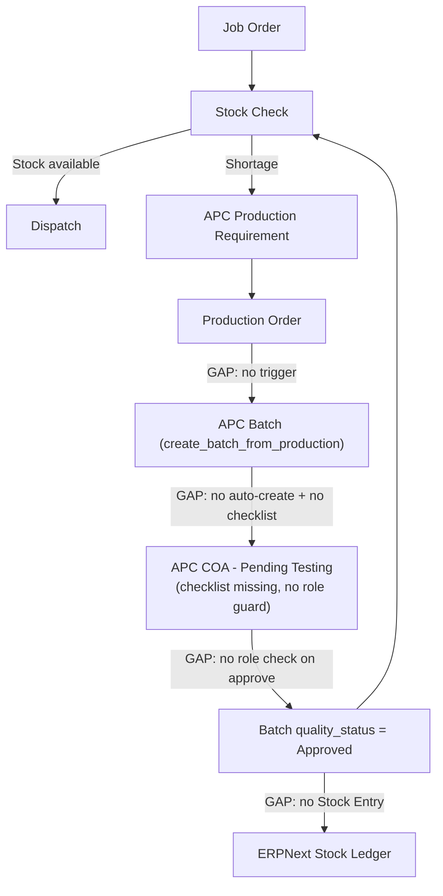
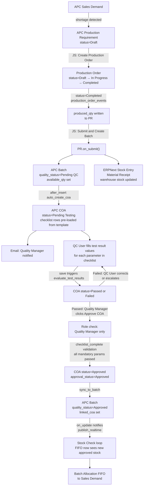

# Production Schedule → Batch Register QC → Stock Update: Detailed Plan

## Current State vs. Diagram



The red-rectangle modules in the diagram (Production Schedule + Batch Register QC) are partially coded but the chain between them is broken at every handoff point. The QC checklist (COA template test parameters) exists in the data model but is never auto-loaded, and `approve_coa()` has no role-based access control.

---

## Files Involved

- [`production/doctype/production_order/production_order.json`](apps/apc_operations/apc_operations/production/doctype/production_order/production_order.json) — add item/warehouse/grade fields
- [`production/doctype/production_order/production_order.py`](apps/apc_operations/apc_operations/production/doctype/production_order/production_order.py) — no changes needed
- [`production/production_order_events.py`](apps/apc_operations/apc_operations/production/production_order_events.py) — add `on_submit` / status-change trigger
- [`production/doctype/apc_production_requirement/apc_production_requirement.py`](apps/apc_operations/apc_operations/production/doctype/apc_production_requirement/apc_production_requirement.py) — auto-batch creation + stock entry
- [`production/doctype/apc_production_requirement/apc_production_requirement.json`](apps/apc_operations/apc_operations/production/doctype/apc_production_requirement/apc_production_requirement.json) — make is_submittable=1, add batch_name field
- `production/doctype/apc_production_requirement/apc_production_requirement.js` — **new file**: form buttons
- [`inventory/doctype/apc_batch/apc_batch.py`](apps/apc_operations/apc_operations/inventory/doctype/apc_batch/apc_batch.py) — add `auto_create_coa()` on insert with template load + QC notification
- [`inventory/doctype/apc_coa/apc_coa.py`](apps/apc_operations/apc_operations/inventory/doctype/apc_coa/apc_coa.py) — add role guard on `approve_coa()`, add `validate_checklist_complete()`
- `inventory/doctype/apc_coa/apc_coa.js` — **new file**: QC checklist UI, Approve/Reject buttons with role visibility
- [`hooks.py`](apps/apc_operations/apc_operations/hooks.py) — register new event handlers
- [`patches/`](apps/apc_operations/apc_operations/patches/) — migration patch for new fields

---

## Step-by-Step Changes

### Step 1 — Add Product Fields to Production Order DocType

**File:** `production_order.json`

Add these fields so Production Order is fully traceable to the product being made:

- `item` — Link to Item (required)
- `item_name` — Data, read-only, fetched from item
- `grade` — Data
- `specification` — Data
- `packaging_type` — Data
- `warehouse` — Link to Warehouse
- `production_requirement` — Link to APC Production Requirement (the demand source)

Also update `production_order.py`'s `validate()` to fetch `item_name` from the Item doctype when `item` is set.

Run `bench migrate` after JSON changes.

---

### Step 2 — Update Production Order Events: Status-Change Trigger

**File:** `production/production_order_events.py`

Add a new handler triggered when `status` changes to `"Completed"`:

```python
def on_update(doc, method=None):
    evaluate_production_order_capacity(doc)
    if doc.status == "Completed" and doc.get_doc_before_save():
        if doc.get_doc_before_save().status != "Completed":
            sync_completion_to_requirement(doc)

def sync_completion_to_requirement(doc):
    if not doc.production_requirement:
        return
    req = frappe.get_doc("APC Production Requirement", doc.production_requirement)
    if req.status not in ["Completed", "Cancelled"]:
        req.wip_quantity = 0
        req.produced_quantity = flt(doc.required_quantity)
        req.save(ignore_permissions=True)
```

This closes the loop: marking a Production Order as Completed automatically pushes `produced_quantity` onto the requirement so its status rolls to `Completed`.

---

### Step 3 — Make APC Production Requirement Submittable + Add batch_name field

**File:** `apc_production_requirement.json`

- Set `is_submittable = 1` so submission is the trigger for batch creation (clear audit trail)
- Add `batch_name` — Link to APC Batch (read-only), filled after batch creation
- Add `coa_name` — Link to APC COA (read-only), filled after COA auto-create

This lets the system track: which batch was produced from which requirement.

---

### Step 4 — Auto-Create Batch on Requirement Submit

**File:** `production/doctype/apc_production_requirement/apc_production_requirement.py`

Move batch creation logic from manual whitelisted method to `on_submit`:

```python
def on_submit(self):
    if not self.batch_created:
        batch_name = self.create_batch_from_production(
            batch_quantity=self.produced_quantity or self.required_quantity,
            manufacturing_date=self.planned_date or today()
        )
        coa_name = self.auto_create_coa(batch_name)
        self.db_set("batch_name", batch_name, update_modified=False)
        self.db_set("coa_name", coa_name, update_modified=False)
        self.post_stock_entry(batch_name)
```

Keep `create_batch_from_production()` as the actual batch-insert logic (already correct), called by `on_submit`.

---

### Step 5 — Post ERPNext Stock Entry on Batch Creation

**File:** `production/doctype/apc_production_requirement/apc_production_requirement.py`

Add `post_stock_entry()` method:

```python
def post_stock_entry(self, batch_name):
    """Post a Manufacturing Stock Entry to record finished goods into ERPNext stock."""
    if not self.warehouse or not self.item:
        return
    erpnext_batch = frappe.db.get_value("APC Batch", batch_name, "erpnext_batch")
    se = frappe.new_doc("Stock Entry")
    se.stock_entry_type = "Material Receipt"
    se.posting_date = today()
    se.append("items", {
        "item_code": self.item,
        "qty": self.produced_quantity or self.required_quantity,
        "t_warehouse": self.warehouse,
        "batch_no": erpnext_batch,
        "uom": self.uom,
        "basic_rate": 0,
    })
    se.insert(ignore_permissions=True)
    se.submit()
    self.db_set("stock_entry", se.name, update_modified=False)
```

This posts a `Material Receipt` stock entry to ERPNext so the warehouse stock balance is updated. Add `stock_entry` as a Link to Stock Entry field in the JSON.

> Note: Use `Material Receipt` (not `Manufacture`) to keep it simple unless BOM-based costing is needed. Can be upgraded to `Manufacture` type later if BOM integration is required.

---

### Step 6 — Auto-Create APC COA on Batch Insert (with Checklist Pre-loaded)

**File:** `inventory/doctype/apc_batch/apc_batch.py`

Add `auto_create_coa()` called from `after_insert`. Critically, it must call `load_template_parameters()` **immediately** so the COA opens with all checklist rows already populated and ready for QC to fill in. Just setting `coa_template` field is not enough — the rows must actually be inserted.

```python
def after_insert(self):
    if not self.batch_number or self.batch_number != self.name:
        self.db_set("batch_number", self.name, update_modified=False)
    self.ensure_erpnext_batch()
    if self.created_from_production:
        self.auto_create_coa()

def auto_create_coa(self):
    existing = frappe.db.exists("APC COA", {"batch": self.name})
    if existing:
        return existing

    coa = frappe.new_doc("APC COA")
    coa.batch = self.name
    coa.product = self.product
    coa.manufacturing_date = self.manufacturing_date
    coa.production_order = self.production_order
    coa.status = "Pending Testing"
    coa.approval_status = "Pending"

    default_template = _get_default_coa_template(self.product)
    if default_template:
        coa.coa_template = default_template
        # Insert first so child rows can be saved
        coa.insert(ignore_permissions=True)
        # Now load template parameters — this populates the test_results checklist rows
        coa.load_template_parameters()
        coa.save(ignore_permissions=True)
    else:
        coa.insert(ignore_permissions=True)

    self.db_set("linked_coa", coa.name, update_modified=False)

    # Notify QC team
    qc_users = _get_qc_users()
    if qc_users:
        frappe.sendmail(
            recipients=qc_users,
            subject=f"QC Required: Batch {self.name} — {self.product}",
            message=(
                f"Batch <b>{self.name}</b> ({self.product}) has been produced and requires QC testing.<br>"
                f"COA: <a href='/app/apc-coa/{coa.name}'>{coa.name}</a><br>"
                f"Please fill in all test parameters and pass to the Quality Manager for approval."
            )
        )
    return coa.name


def _get_default_coa_template(product):
    """Look up an active COA Template associated with this product's item group."""
    item_group = frappe.db.get_value("Item", product, "item_group")
    if not item_group:
        return None
    # Convention: COA Template name matches the normalized product group
    # or is set on a custom field coa_template on Item Group
    template = frappe.db.get_value(
        "COA Template",
        {"active": 1, "item_group": item_group},
        "name"
    )
    return template


def _get_qc_users():
    """Return email addresses of all active Quality Manager and Quality User role holders."""
    users = frappe.db.sql("""
        SELECT DISTINCT u.email FROM `tabUser` u
        INNER JOIN `tabHas Role` r ON r.parent = u.name
        WHERE r.role IN ('Quality Manager', 'Quality User')
        AND u.enabled = 1 AND u.email IS NOT NULL AND u.email != ''
    """, as_list=True)
    return [row[0] for row in users]
```

> Note: `COA Template` currently has no `item_group` field. A `item_group` Link field must be added to `COA Template` JSON so templates can be auto-matched per product group.

---

### Step 6b — QC Checklist Validation and Role Guard on COA Approval

**File:** `inventory/doctype/apc_coa/apc_coa.py`

The current `approve_coa()` method only checks `status == "Passed"` but has no role check. Any user with write access can approve. Fix this:

```python
@frappe.whitelist()
def approve_coa(self, remarks=None):
    # Role guard: only Quality Manager or System Manager can approve
    allowed_roles = {"Quality Manager", "System Manager"}
    user_roles = set(frappe.get_roles(frappe.session.user))
    if not allowed_roles.intersection(user_roles):
        frappe.throw(
            _("Only a Quality Manager can approve a COA"),
            frappe.PermissionError
        )

    # Checklist completeness guard
    self.validate_checklist_complete()

    self.evaluate_test_results()
    if self.status != "Passed":
        frappe.throw(_("Only a Passed COA can be approved. Ensure all mandatory test parameters pass."))

    self.status = "Approved"
    self.approval_status = "Approved"
    self.coa_status = "Approved"
    self.approved_by = frappe.session.user
    self.approved_on = now()
    self.approved_date = self.approved_on
    if remarks:
        self.qc_remarks = remarks
    self.save()

    frappe.msgprint(_("COA {0} has been approved. Batch is now available for allocation.").format(self.name))
    return {"success": True, "message": "COA approved"}


def validate_checklist_complete(self):
    """
    Block approval if:
    - Any mandatory test parameter has no result entered
    - Any mandatory test parameter has status = Fail
    """
    if not self.test_results:
        frappe.throw(_("No test results found. Load a COA Template and fill all parameters before approving."))

    missing = []
    failed = []
    for row in self.test_results:
        if not row.mandatory:
            continue
        has_result = row.numeric_result not in (None, "") or (row.text_result or row.result_value or "").strip()
        if not has_result:
            missing.append(row.parameter_name or row.parameter)
        elif row.status == "Fail":
            failed.append(row.parameter_name or row.parameter)

    if missing:
        frappe.throw(
            _("Cannot approve. The following mandatory parameters have no result: {0}").format(
                ", ".join(missing)
            )
        )
    if failed:
        frappe.throw(
            _("Cannot approve. The following mandatory parameters have failed: {0}").format(
                ", ".join(failed)
            )
        )
```

Similarly update `reject_coa()` to also require Quality Manager role:

```python
@frappe.whitelist()
def reject_coa(self, reason=None):
    allowed_roles = {"Quality Manager", "System Manager"}
    if not set(frappe.get_roles(frappe.session.user)).intersection(allowed_roles):
        frappe.throw(_("Only a Quality Manager can reject a COA"), frappe.PermissionError)
    # ... rest of existing logic unchanged
```

---

### Step 6c — Add item_group Field to COA Template

**File:** `inventory/doctype/coa_template/coa_template.json`

Add one field:

- `item_group` — Link to Item Group — used to auto-match the correct template when a batch is created for a product

This allows `_get_default_coa_template(product)` to find the right template automatically.

---

### Step 7 — Create apc_coa.js (New File) — QC Checklist UI

**File:** `inventory/doctype/apc_coa/apc_coa.js`

The COA form needs clear UI buttons that reflect the two-level workflow:

- **QC User** fills in test result values in the `test_results` table
- **Quality Manager** approves or rejects

```javascript
frappe.ui.form.on("APC COA", {
    refresh(frm) {
        // Status progress bar
        const statuses = ["Draft", "Pending Testing", "Passed", "Approved"];
        frm.dashboard.add_progress(
            __("QC Progress"),
            statuses.indexOf(frm.doc.status) * 25
        );

        const isQCUser = frappe.user.has_role(["Quality User", "Quality Manager", "System Manager"]);
        const isQCManager = frappe.user.has_role(["Quality Manager", "System Manager"]);

        // Load Template button — if no test results yet
        if (isQCUser && !frm.doc.test_results?.length && frm.doc.coa_template && frm.doc.docstatus === 0) {
            frm.add_custom_button(__("Load Checklist"), () => {
                frm.call("load_template", { clear_existing: 0 }).then(() => frm.reload_doc());
            }, __("QC Actions"));
        }

        // Re-evaluate test results
        if (isQCUser && frm.doc.test_results?.length && frm.doc.docstatus === 0) {
            frm.add_custom_button(__("Evaluate Results"), () => {
                frm.save().then(() => frm.reload_doc());
            }, __("QC Actions"));
        }

        // Approve button — Quality Manager only, when status = Passed
        if (isQCManager && frm.doc.status === "Passed" && frm.doc.approval_status === "Pending") {
            frm.add_custom_button(__("Approve COA"), () => {
                frappe.prompt(
                    { label: __("Approval Remarks"), fieldtype: "Small Text", fieldname: "remarks" },
                    (vals) => {
                        frm.call("approve_coa", { remarks: vals.remarks })
                            .then(() => frm.reload_doc());
                    },
                    __("Confirm Approval"),
                    __("Approve")
                );
            }, __("QC Actions"));
        }

        // Reject button — Quality Manager only
        if (isQCManager && !["Approved", "Rejected", "Cancelled"].includes(frm.doc.status)) {
            frm.add_custom_button(__("Reject COA"), () => {
                frappe.prompt(
                    { label: __("Rejection Reason"), fieldtype: "Small Text", fieldname: "reason", reqd: 1 },
                    (vals) => {
                        frm.call("reject_coa", { reason: vals.reason })
                            .then(() => frm.reload_doc());
                    },
                    __("Confirm Rejection"),
                    __("Reject")
                );
            }, __("QC Actions"));
        }

        // Status indicator
        const colorMap = {
            "Draft": "gray", "Pending Testing": "yellow",
            "Passed": "green", "Failed": "red",
            "Approved": "blue", "Rejected": "red", "Cancelled": "gray"
        };
        frm.dashboard.add_indicator(__(frm.doc.status), colorMap[frm.doc.status] || "gray");

        // Link to batch
        if (frm.doc.batch) {
            frm.add_custom_button(__("View Batch"), () => {
                frappe.set_route("Form", "APC Batch", frm.doc.batch);
            });
        }
    }
});
```

---

### Step 8 — Create apc_production_requirement.js (New File)

**File:** `production/doctype/apc_production_requirement/apc_production_requirement.js`

Provide form buttons for production operations:

```javascript
frappe.ui.form.on("APC Production Requirement", {
    refresh(frm) {
        // Show "Link Production Order" button when no PO linked
        if (!frm.doc.production_order && frm.doc.status !== "Completed") {
            frm.add_custom_button(__("Create Production Order"), () => {
                frappe.new_doc("Production Order", {
                    item: frm.doc.item,
                    item_description: frm.doc.item_name,
                    required_quantity: frm.doc.required_quantity,
                    uom: frm.doc.uom,
                    production_requirement: frm.doc.name,
                    warehouse: frm.doc.warehouse,
                    grade: frm.doc.grade,
                    specification: frm.doc.specification,
                    planned_date: frm.doc.planned_date || frm.doc.required_date,
                });
            });
        }

        // Show "Submit & Create Batch" only when docstatus == 0 and produced_quantity set
        if (frm.doc.docstatus === 0 && frm.doc.status === "Completed") {
            frm.add_custom_button(__("Submit & Create Batch"), () => {
                frappe.confirm(
                    `Create batch for ${frm.doc.produced_quantity} ${frm.doc.uom} of ${frm.doc.item_name}?`,
                    () => frm.save_or_update().then(() => frm.submit())
                );
            }, __("Actions"));
        }

        // Show link to created batch
        if (frm.doc.batch_name) {
            frm.add_custom_button(__("View Batch"), () => {
                frappe.set_route("Form", "APC Batch", frm.doc.batch_name);
            });
        }
        if (frm.doc.coa_name) {
            frm.add_custom_button(__("View COA"), () => {
                frappe.set_route("Form", "APC COA", frm.doc.coa_name);
            });
        }
    }
});
```

---

### Step 9 — Close the Stock Loop: Re-evaluate Demand on Batch Approval

**File:** `inventory/doctype/apc_batch/apc_batch.py`

In `on_update`, when `quality_status` changes to `"Approved"`, trigger re-evaluation of pending production requirements for the same product:

```python
def on_update(self):
    self.ensure_erpnext_batch()
    self.sync_coa_status()
    self.check_allocation_limits()
    # Close the stock loop: when batch is approved, re-evaluate open requirements
    if self.quality_status == "Approved":
        before = self.get_doc_before_save()
        if before and before.quality_status != "Approved":
            self.notify_batch_available_for_allocation()

def notify_batch_available_for_allocation(self):
    open_requirements = frappe.get_all(
        "APC Production Requirement",
        filters={"item": self.product, "status": ["in", ["In Production", "Partially Completed"]]},
        pluck="name"
    )
    for req_name in open_requirements:
        frappe.db.set_value("APC Production Requirement", req_name,
            "status", "Completed", update_modified=False)
    # Realtime push so Production Dashboard reflects the change immediately
    frappe.publish_realtime(
        "batch_approved",
        {"batch": self.name, "product": self.product},
        after_commit=True
    )
```

---

### Step 10 — Register New Events in hooks.py

**File:** `hooks.py`

The `Production Order` doc_events already registers `on_update`. No new hook needed — `production_order_events.py` already handles this. Ensure `APC Production Requirement` `on_submit` is registered:

```python
"APC Production Requirement": {
    "on_update": "apc_operations.production.doctype.apc_production_requirement.apc_production_requirement.on_update_production_requirement",
    "on_submit": "apc_operations.production.doctype.apc_production_requirement.apc_production_requirement.on_submit_production_requirement",
},
```

---

### Step 11 — Migration Patch

**File:** `patches/v0_1/add_production_order_item_fields.py`

```python
import frappe

def execute():
    frappe.reload_doc("production", "doctype", "production_order")
    frappe.reload_doc("production", "doctype", "apc_production_requirement")
    frappe.reload_doc("inventory", "doctype", "coa_template")
```

Register it in `patches.txt`. Run `bench migrate` after.

---

## Complete Flow After Fix



---

## QC Approval Roles Summary

| Action | Role Required |
|---|---|
| View COA | Quality User, Quality Manager, Shipping Manager |
| Fill test result values | Quality User, Quality Manager |
| Load template / checklist | Quality User, Quality Manager |
| Approve COA | Quality Manager only |
| Reject COA | Quality Manager only |
| Create APC Batch (submit PR) | Production Manager |

---

## What Is NOT Changing

- Dispatch, Shipping, Transport, Security, Gate Pass flows — untouched
- FIFO allocation logic — untouched (already correct)
- Zoho integration — untouched
- COA test parameter pass/fail evaluation logic — untouched (already works)
